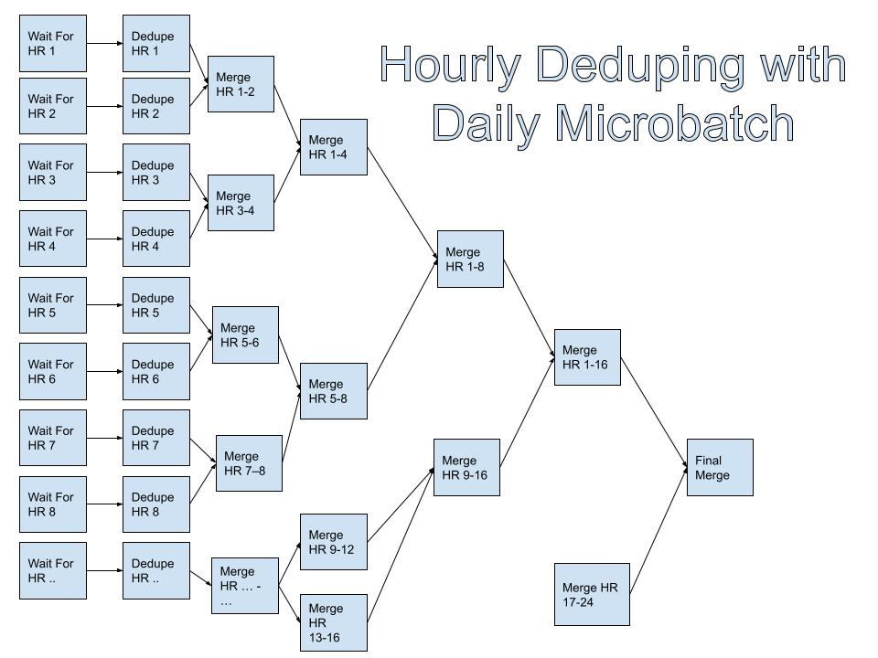

# Microbatch Hourly Deduped Tutorial

Deduping hourly data can be challenging. The duplicates can occur across hours as well. 

This design is how you can reduce the daily data latency dramatically by deduping your data both hourly and across hours using GROUP BY and FULL OUTER JOIN

An example DAG in Airflow is [here](pipeline.py)

## Diagram

